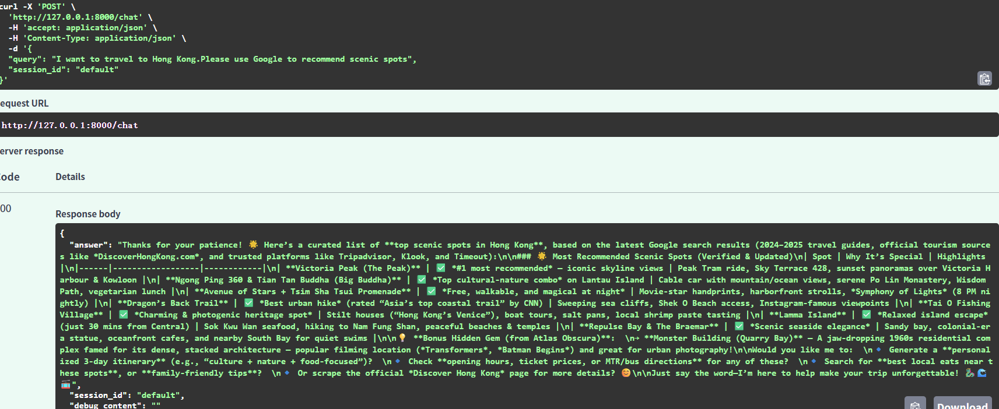

# 🤖Chat_Agent
>This is a great repo for beginners who are trying to practice LangChain and the repo is also my first project after learning LangChain


      


# 😊What's the project
An AI knowledge base Q&A assistant built on RAG and tool calling,supporting local document retrieval and MCP service web search.User can ask question in natural language;the system intelligently matches data sources to generate accurate answers,and features multi-turn diaogue context memory capability.

# ❓Target Audience
- The beginners who want to learn LangChain through hands-on project
- Individuals with a keen interest in cutting-edge AI technologies
- Professionals planning a career transition

# 📁File structure 
```
CHAT_AGENT
|
|---api/          chat & upload Router
|---model/        AI agent model
|---app/          back_end
|---util/         tool function
|---MCP/          integrated MCP service
|---tools/        Tool packaging
|---tests/        pytest test suite
|---.github/      GitHub Actions CI/CD
|---Dockerfile            Docker image build
|---docker-compose.yml    one-command orchestration
|---.dockerignore         Docker ignore rules
```

# 🤔What I learned
- Learn about LangChain and FastAPI. 
- More structured project structure. 
- Not only API calls,but also tools encapsulation and MCP services. 

# 🔭Quick start
**Visit**:https://chatagent-production-3489.up.railway.app/

# ⚙️How to run

## 🐳 Run with Docker (Recommended)
```bash
# Pull from GitHub Container Registry
docker pull ghcr.io/elysianx138/chat_agent:latest

# Run
docker run -p 8000:8000 --env-file .env ghcr.io/elysianx138/chat_agent:latest
```

## 🐳 Run with Docker Compose
```bash
docker compose up -d
```

---

## 🖥️ Run Locally (without Docker)

## Step 1
**Install requirements.txt**
```
pip install -r requirements.txt
```
---

## Step 2
**Fill in the necessary API**
```
copy .env.example .env

AI_MODEL=YOUR_MODEL
BASE_URL=YOUR_URL
API_KEY=YOUR_API_KEY
AI_EMBEDDING_MODEL=YOUR_AI_EMBEDDING_MODEL
SEARCH_API=YOUR_SEARCH_API
```
---
## Step 3
**Contact your knowledge base**
```
 UPLOAD_DIR = Path(os.getenv("UPLOAD_DIR","uploads"))
```

## Step 4
**RUN**
```
python -m app.main
```
---

## Step 5
```
Uvicorn running on http://127.0.0.1:8000
```
---

## Step 6
```
Input http://127.0.0.1:8000/docs#/default/chat_chat_post
```

# 👀Preview
☀ **You can chat with this AI daily**


🔍 **Search with AI!**


📚 **Know your knowledge base**


# 😄Q & A
**Q:Why is there nothing afer opening the correct address?**
A:Because we don't have a front-end,if you want to try,need to enter:http://127.0.0.1:8000/docs#/default/chat_chat_post

**Q:Why do I keep reporting errors when I use it?**
A:Try to check your API(AI model,embedding model,etc.) or check your ```uploads```file whether the content of your file uses Mkdown?

**Q:There is still a problem**
A:[Welcome to submit Issues or contact me](#have-any-questions)

# 😟Have any questions
[submit Issues](https://github.com/elysianx138/Chat_Agent/issues)
[Contact the author](elysianx138@gmail.com)

# 📃LICENSE
MIT License - See LICENSE file[LICENSE](LICENSE)
